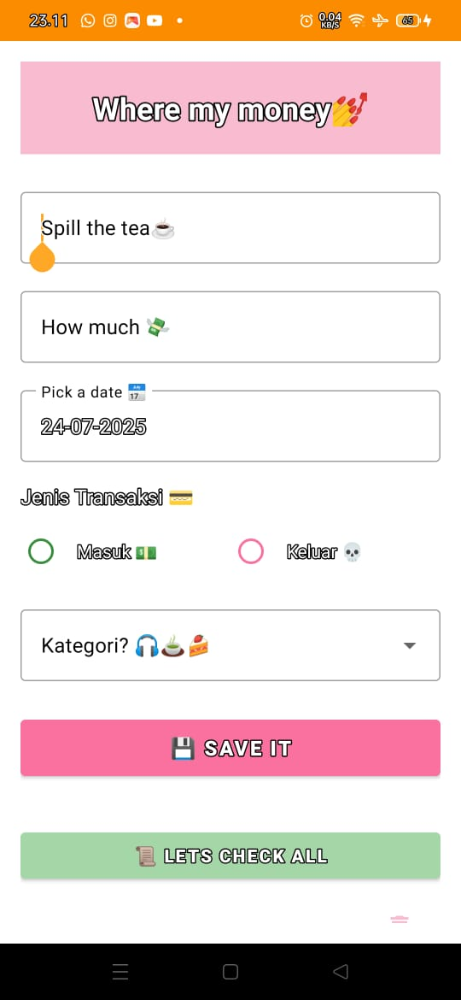
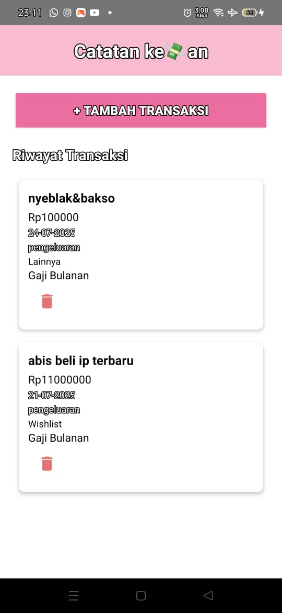

# 💸 MyCatatan keUangan — Where My Money Goes?! 💅

Aplikasi Android estetik buat kamu yang suka tracking uang masuk-keluar, biar dompet gak nangis tiap akhir bulan 😭✨  
Yap! Ini dia **MyCatatan Keuangan** — personal money tracker dengan tampilan girly, warna pink matcha 🍵 dan emoji yang relatable!

---

## ✨ Fitur Utama

📌 Tambah transaksi baru (masuk / keluar)  
📌 Pilih tanggal dan kategori transaksi  
📌 Tersimpan otomatis di lokal via Room Database  
📌 Lihat semua riwayat transaksi secara rapi  
📌 Tampilan Gen-Z friendly — emoji? banyak!  
📌 Tema pink + matcha 🍵 yang calming dan cute  

---

## 🧱 Teknologi yang Dipakai

- Android Studio (2024.1.1.13)
- Bahasa Kotlin
- Room (Local Database)
- Material Design Components
- RecyclerView
- ViewBinding

---

## 📸 Tampilan Aplikasi

# #> 💁‍♀️ Form Tambah Transaksi:



## > 🧾 Riwayat Transaksi:



---

## 📂 Struktur Proyek

MyCatatUang/
├── model/ # Data model & Room entity
├── adapter/ # Adapter untuk RecyclerView
├── database/ # Room database dan DAO
├── FormTransaksiActivity.kt
├── MainActivity.kt
└── ...


## 🚀 Cara Menjalankan

1. Clone repositori ini:
   ```bash
   git clone https://github.com/DedeSyifaSifriani/MyCatatan-UAS.git
   
2.Buka di Android Studio

3.Jalankan di emulator atau perangkat fisik

📌 Catatan
Mode malam dinonaktifkan agar warna tetap cerah dan konsisten.
Semua file Activity, Adapter, dan Entity diletakkan dalam folder model.

## 👩🏻‍💻 Developer
🧕 Dede Syifa Sifriani
📚 Mahasiswi Teknik Informatika
📎 Proyek UAS Pemrograman Mobile 2
📅 Juli 2025
-Dikembangkan oleh mahasiswa untuk memenuhi proyek UAS mata kuliah Pemrograman Mobile2. Proyek ini sekaligus menjadi latihan pembuatan aplikasi personal finance sederhana.

🌐 Lisensi
Proyek ini bersifat open-source. Silakan modifikasi dan gunakan sesuai kebutuhan.

Terima kasih telah mengunjungi proyek ini! Jangan lupa ⭐ kalau bermanfaat 😄
